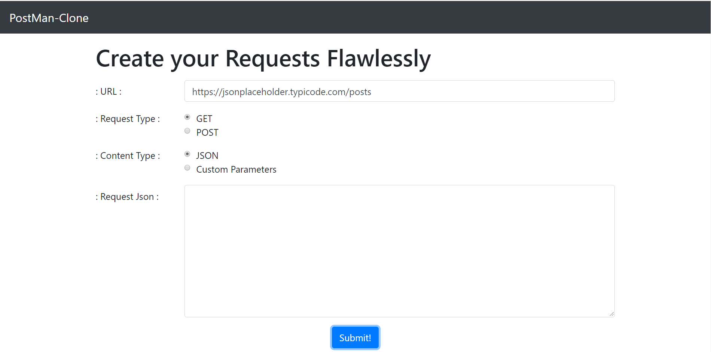
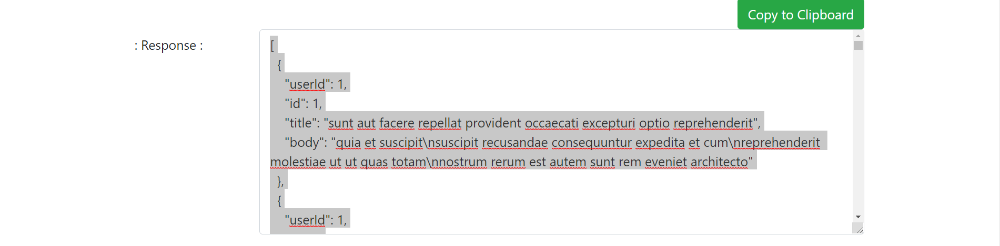

# PostMan-Clone

<h3>App for interacting with HTTP APIs. It presents you with a friendly GUI for constructing requests and reading responses.</h3>

<h3>Select Request Type: POST / GET</h3>

<h3>Pass Json or Custom Parameters</h3>

<h3>Get response in Json Format</h3>

